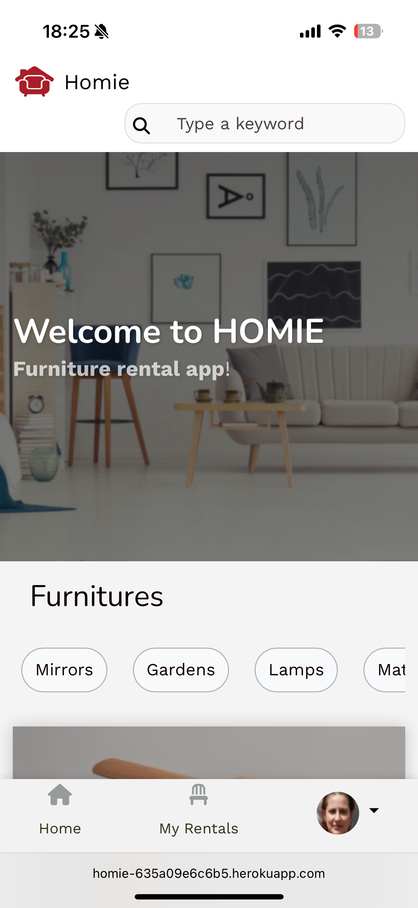

Furniture Rental App

This is a marketplace app (Airbnb clone) built with Ruby on Rails. The application enables users to list, browse, and rent furniture items online, providing a seamless experience for both furniture owners and renters. Users can upload photos, set rental prices and availability, manage bookings, and communicate securely through the platform. The app includes user authentication, detailed product pages, booking management, and administrative controls to ensure a safe and trustworthy environment.

---

## Screenshots


| Home Page | Listing | Booking |
|-----------|---------|---------|
|  |  |  |


[Homie](https://homie-635a09e6c6b5.herokuapp.com/)
---

## Features

- User authentication and registration
- List furniture for rent with images and descriptions
- Browse and search available furniture by category, location, or keywords
- Booking and rental management with calendar availability
- Secure messaging between renters and owners
- Ratings and reviews for listings and users
- Payment integration for secure transactions
- User profiles and dashboards
- Admin panel for managing listings, users, and bookings

---

## Tech Stack

- **Backend:** Ruby on Rails
- **Frontend:** HTML, SCSS, JavaScript
- **Database:** PostgreSQL (default)
- **Other:** Docker for containerization

---

## Getting Started

### Prerequisites

- Ruby (see `.ruby-version` for version)
- Rails (see `Gemfile` for version)
- PostgreSQL
- Yarn (for managing JS dependencies)
- Docker and Docker Compose (optional, for containerized setup)

### Setup

#### 1. Clone the repository

```sh
git clone https://github.com/owenswebdevelopment/furniture-rental-app.git
cd furniture-rental-app
```

#### 2. Install dependencies

```sh
bundle install
yarn install
```

#### 3. Set up the database

```sh
rails db:setup
```

#### 4. Start the Rails server

```sh
rails server
```

The app should now be running at [http://localhost:3000](http://localhost:3000).

### Using Docker (optional)

If you want to use Docker:

```sh
docker-compose build
docker-compose up
```

---

## Environment Variables

Some features (e.g., image uploads with Cloudinary) require environment variables. Copy `.env.example` to `.env` and fill in your credentials.

---

## Contributing

1. Fork the repository
2. Create your feature branch (`git checkout -b feature/my-feature`)
3. Commit your changes (`git commit -am 'Add some feature'`)
4. Push to the branch (`git push origin feature/my-feature`)
5. Open a pull request

---

## License

This project is licensed under the MIT License.

---

## Acknowledgments

- Inspired by Airbnb's marketplace model
- Built with the Rails community’s best practices
